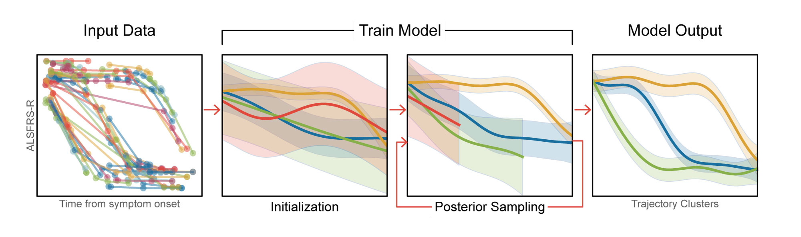

# MoGP: Mixture of Gaussian Processes Model for Sparse Longitudinal Data

## Background
MoGP is a a flexible framework for clustering longitudinal data to identify trajectory patterns



The model leverages two Bayesian nonparametric methods:
- **Gaussian process regression**: Learns trajectories from data, enabling the model to capture a wide variety of progression patterns; Does not require the specification of a particular functional form
- **Dirichlet process clustering**: Determines a number of clusters that is consistent with the number of trajectory trends observed in the data; Does not require the specification of a number of clusters a priori

The model was developed in the context of ALS disease progression modeling where all clinical scores are expected to decline over  time, and therefore includes an option for using an inductive bias towards monotonic decline.

## Tutorials
Tutorials for model usage can be found here:
- [Tutorial: Training a MoGP Model](example/tutorial_train_mogp_model.ipynb)
- [Tutorial: Using the ALSFRS-R Reference Model](example/tutorial_reference_model_predictions.ipynb)

We also provide a pre-trained reference model for ALSFRS-R scores that can be downloaded here: http://fraenkel.mit.edu/mogp/

## Installation
Install using `pip`:
```
pip install mogp
```

If this does not work, you can also install from within the MoGP repository:
```
git clone https://github.com/fraenkel-lab/mogp
cd mogp/
python setup.py install --user
```
## Relevant Citations

Divya Ramamoorthy, Kristen Severson, Soumya Ghosh, Karen Sachs, Answer ALS, Jonathan D. Glass, Christina N. Fournier, Pooled Resource Open-Access ALS Clinical Trials Consortium, James Berry, Kenney Ng, Ernest Fraenkel. Identifying Patterns of ALS Progression from Sparse Longitudinal Data. *medRxiv. [doi: 10.1101/2021.05.13.21254848](https://doi.org/10.1101/2021.05.13.21254848)*
